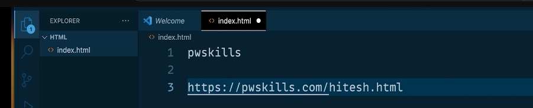

# Html_Css
html and css! will do

documentation: mdn
previosuly .htm was used and on apache and old dotnet, tis still used

when we make a file, then it runs on server and servers are not some big pcs but more of a software like i installed apache, so it says i will have this url for u and will tak e a folder
 
now in that folder there will be various files, so index file are more like the beginning point, so it would be default or index, now its index only

in previous days we had to specify what we were using like the doc was html or css or article